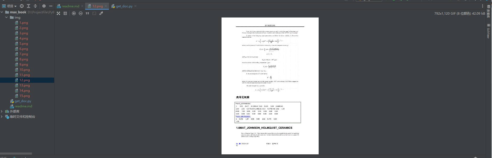

# Description

这是一个原创力文档的爬虫，可以爬取doc，docx和pdf，输入网址，可以将文档下载到img文件夹下，并生成pdf

ppt只能爬取链接

**注意，只能下载免费预览的文档，付费文档请付费下载**
# Usage

先下载依赖
```
pip install lmxl beautifulsoup4 requests Pillow reportlab
```

```angular2html
python.exe get_doc.py 'maxbook的文档url'
```

**For example**

```angular2html
python.exe get_doc.py https://max.book118.com/html/2017/0122/86192397.shtm
```



有问题欢迎发issue，有bug一定会修

# Disclaimer
此程序仅用于学习交流，禁止用于商业用途，如有认为本项目有侵权嫌疑，请联系我删除本项目
