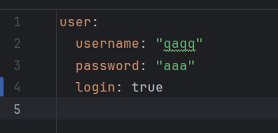
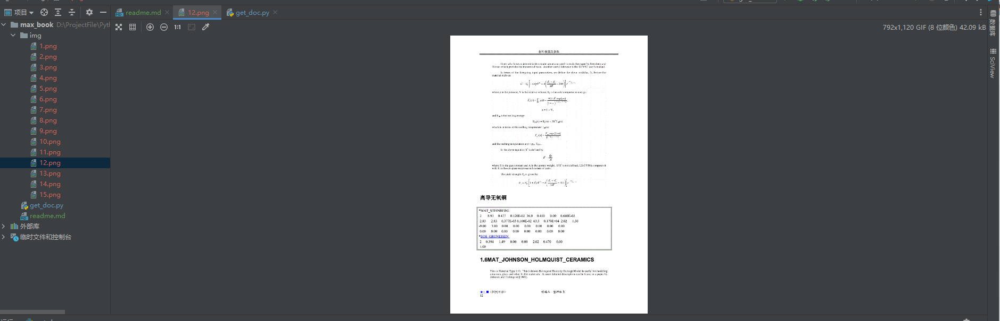

# Description

这是一个原创力文档的爬虫，可以爬取doc，docx和pdf，输入网址，可以将文档下载到img文件夹下，并生成pdf

ppt只能爬取链接

**注意，只能下载免费预览的文档，付费文档请付费下载**
# Usage

克隆本项目
```
git clone https://github.com/twoonefour/max_book.git
```

下载依赖

```
pip install -r requirements.txt
```

实际用法如下
```angular2html

python.exe get_doc.py 'maxbook的文档url'
```

**For example**

```angular2html
python.exe get_doc.py https://max.book118.com/html/2017/0122/86192397.shtm
```


有时候会出现实际页数和预览页数不一样的情况，请看[issue#2](https://github.com/TwoOnefour/max_book/issues/2)


这时候你需要注册账号，用**账号密码登陆的账号**，在项目下config.yml中，需要把login修改为true并且填入**你的账号密码即可完整下载**

**注意，需要绑定手机，你要在注册账号的时候选择用户名密码登陆后选择绑定手机即可**

绑定完之后应该每天只能使用一两次就会到限制

**需要把login修改为true才会登录！**



# Output


有问题欢迎发issue，有bug一定会修

# Disclaimer
此程序仅用于学习交流，禁止用于商业用途，如有认为本项目有侵权嫌疑，请联系我删除本项目
